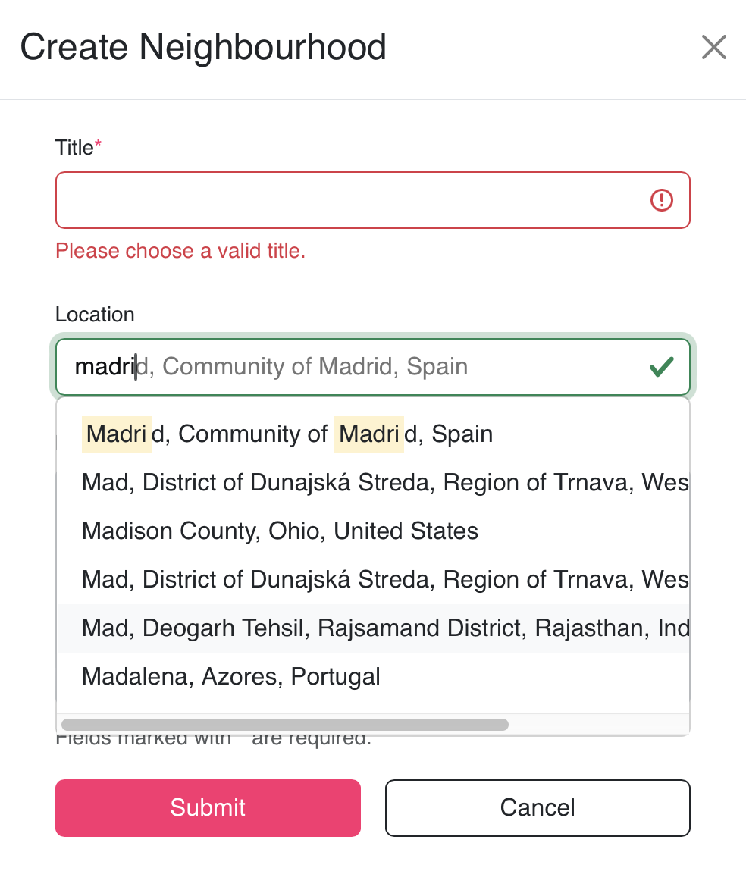

One of the main features of "Neighborhood" is that each community created on our platform can be tied to a real-world location. In order to implement this feature in a more manageable way, we’ve decided to split it into multiple parts or sub-features:

1. Allow admins to add a **valid** address to their neighborhoods.
   - By valid we mean that the location can be verified that it actually exists. The user cannot input fictive addresses.
2. Browse neighborhoods on a map:
   - Neighborhoods would be shown as pins on the map;
   - Each pin also acts as a link to that respective Neighborhood's page;
   - The map should be centered on the user's current location (if the user agrees).
3. In each neighborhood page show a small map centered on that neighborhood's location;

In order to achieve all the points above we needed a map provider. From our research, we came down to two options: Google Maps and OpenStreetMap. After carefully analyzing the pros and cons of each provider we've decided to opt for OpenStreetMap due to its free and open-source nature.

The implementation of the first step of the plan, to allow users to add a valid address to a neighborhood, was done with the aid of a _typeahead_ input that asynchronously queries the OpenStreetMap provider in order to display a list of possible addresses based on what the user has typed so far.

{:width="100%" height="200px"}

In order to ensure that each neighborhood has a valid address, the user is forced to select a value from the list provided by the OpenStreetMap API. This ensures the integrity of the input location and also provides the latitude and longitude values necessary to properly display the pin on the map.

The next step was to show the location of each neighborhood on an interactive map. Our initial approach was to retrieve all neighborhoods and their coordinates from the database, irrespective of their actual location and render them on the map provided by OpenStreetMap. While this approach works fine if you have a small number of neighborhoods, we’ve considered that it might pose performance issues and long loading times in the case of larger data sets. In reality, the user doesn’t need all neighborhood locations to be loaded since he/she is only interested in the locations that they can actually see on the specific part of the map they are on. If the bounds of the map are centered on the city of Madrid for example, there is no need to load neighborhoods in Italy.

** Add screenshot of map here **

In order to make this desired behavior a reality, the following sequence of actions is triggered each time the user moves position on the map:

1. Retrieve the coordinates of the current boundary of the map;
2. Query the database in order to get the neighborhoods whose coordinates are within the bounds defined in step 1;
3. Display a pin on the map for each neighborhood retrieved at step 2.

With this approach, we have multiple requests to the backend server, depending on how many times the user changes position on the map. This solves our initial problem, but creates another one: if the user moves too fast and too often on the map he/she will create too many requests to our backend. In order to prevent this we’ve wrapped the event that triggered a request to our API in a debounce function that makes sure that the user has stopped moving on the map before it sends the request.
