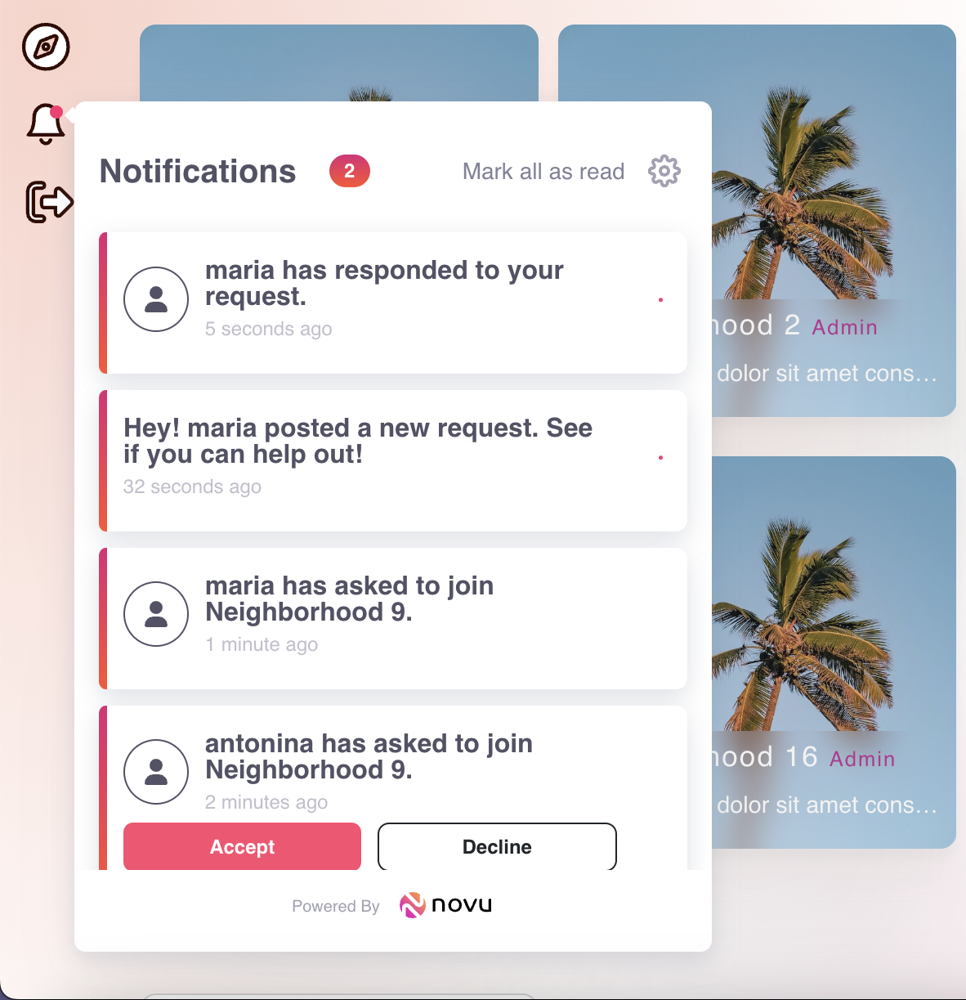

We really wanted to make the app feel vibrant to users and provide them with a sense of instantaneous communication. To achieve that, we needed to support real-time notifications. If Bianca wanted to join Jim's neighborhood, she should be able to make a request that notifies Jim. If someone in Jim's neighborhood made a new request, all their neighbors should be notified to get back to them as soon as possible.

Our initial research directed us towards using a service like [Socket.io](https://socket.io/) to create the notification system from scratch. We also came across [Novu](https://novu.co/), a platform that abstracts all the complexity of implementing sockets away from the developer, and provides a clean and feature-rich API to work with.

One downside to using the Novu API was that we would be limited to using only the existing features and endpoints it provides. It would also mean relying on the Novu community to fix any bugs in their API, taking control of the fix times out of our hands.

At the same time, Novu was fairly easy to integrate into our existing codebase, which uses React and Node.js, and provided good documentation and a helpful AI-assisted search when the docs were lacking. The Novu team also seemed very responsive in the Novu Discord community, ready to provide support, answer questions, and look into potential bugs. Moreover, Novu is an open-source project that is constantly improved and developed.

Weighing the pros and cons, we decided to leverage Novu's infrastructure with a ready-made, highly customisable React component to display the notifications, and several API endpoints at our disposal to tailor its behaviour to our app's needs.
