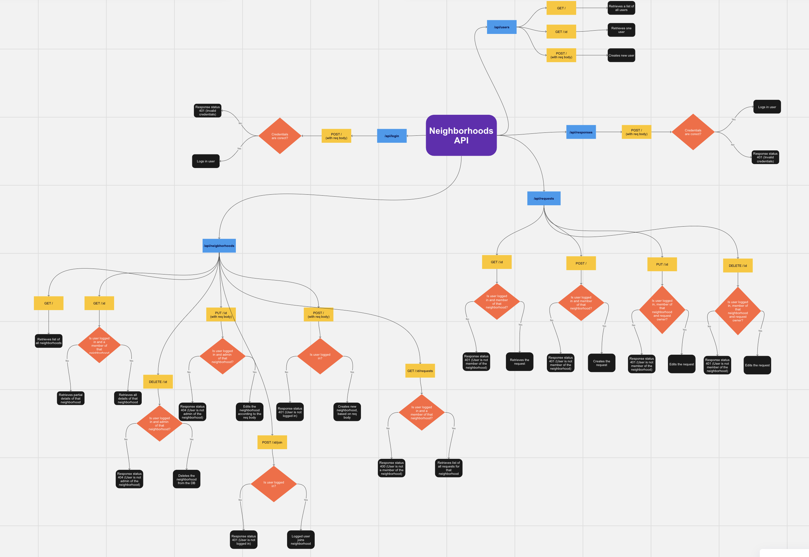

RE-WRITE!

In developing the API for _Neighbourhood_ we wanted to ensure that we adhere to REST[^1] principles.

Leveraging these principles, we designed an API that prioritized user-centric account management. Through standardized endpoints for user registration and authentication, users could create accounts and log in securely, adhering to the principles of statelessness and uniform interface. This ensured a consistent and intuitive experience for users across different devices and platforms.

Our API facilitated neighborhood creation, membership management, and interaction, following RESTful conventions for resource manipulation. By defining clear and predictable endpoints for neighborhood CRUD operations, users could seamlessly create, join, or leave neighborhoods, while neighborhood admins could approve membership requests with ease.

Members' responses to requests were seamlessly facilitated through our API, aligning with REST principles for resource interaction. By defining endpoints for browsing and responding to requests, users could engage in mutual assistance, fostering a culture of collaboration and community support.

By following established patterns for resource management, interaction, and manipulation, we ensured a seamless and intuitive user experience.

---

[^1]: https://restfulapi.net
