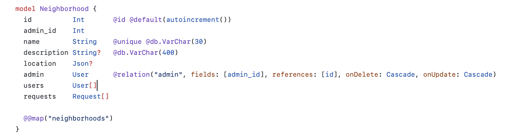
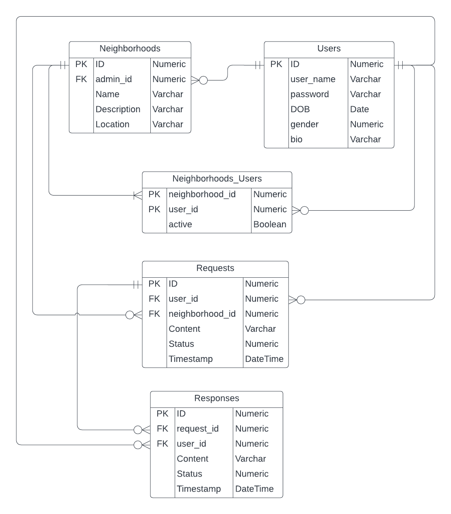

In the case of _Neighbourhood's_ development, the first thing that we started with was designing the database and identifying the main entities that interact with each other. Based on our requirements for the MVP, we came up with the following list:

- Neighbourhood
- User
- Request
- Response

We then fleshed out these entities by chosing the properties that they should have.

This is the initial schema we designed:

This schema met all of our requirements when we first started development, but as we've decided to add more features such as real-time notifications and location based search, the schema suffered some changes.
In the process of adapting the database to our growing needs, the decision to adopt Prisma saved us a lot of time. Prisma is an ORM (Object Relational Mapping) which maps the entities of a database to objects that allowed us to create, read and manipulate data. It hides some of the complexity of databases and allow for easier interaction with the data via objects.
