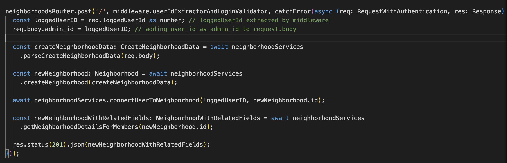
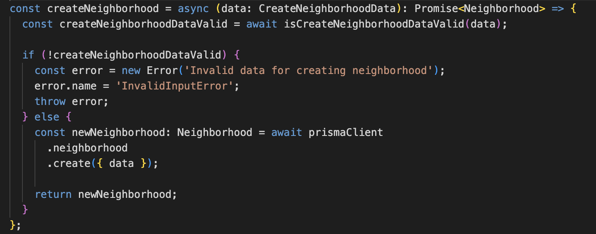

The backend was structured in three main layers, based on the principles of Service Oriented Architecture:

1. The Controller layer:
   - Receives incoming requests;
   - Extracts logged user and validates login (depending if route is protected or not);
   - Calls the appropriate service depending on the purpose of the route.
   - The controller layer does not perform any processing on the incoming data. It is simply a means for receiving a request, validating if there is a logged in user and forwarding the data to the appropriate service.
2. The Service layer:
   - This is where the data sent by the user via HTTP requests is processed (if necessary) and is forwarded to the Data Access layer in order to make the necessary updates on the database;
     
3. The Data Access layer:
   - This layer performs the necessary updates on the database. In our case this was handled by Prisma (An Object Relational Mapping service);
   - Every database table was mapped to a Prisma model, which allowed us to update the database without having to write SQL code from scratch;
   - Using Prisma also gave us the advantage of providing TypeScript types for every database entity.
     

This 3 layered architecture ensures simplicity and a well defined separation of concerns. It also makes the codebase easier to work with since each layer handles a very specific part of the application.

Following this design philosophy, each layer is completely independent from the other. For example, the controller layer only knows it has to call a particular service but it does not know how that service is actually implemented. This gives us the freedom to change any service at will without having to make extensive changes to the codebase.
